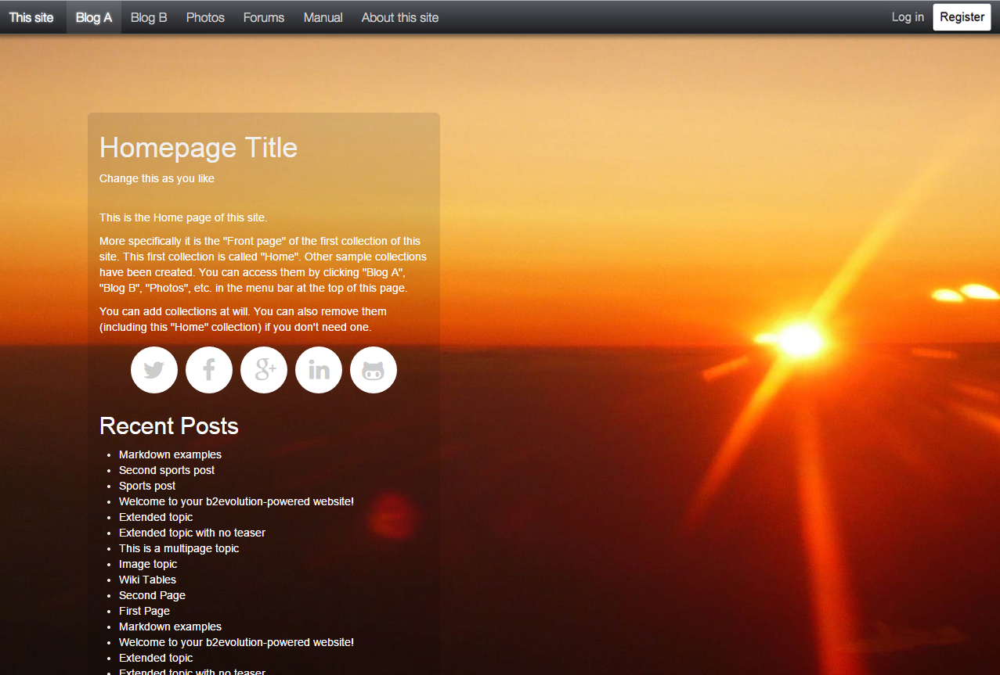

## Bootstrap Main skin for b2evolution CMS.

This responsive skin uses the twitter bootstrap framework. Bootstrap Main skin is completely configurable in the back-office. You can change content width, colors, background image, re-order widgets and much more.
This skin is included in b2evolution 5.1.1 (to be released shortly).

Link to skin: http://skins.b2evolution.net/bootstrap-main-skin

